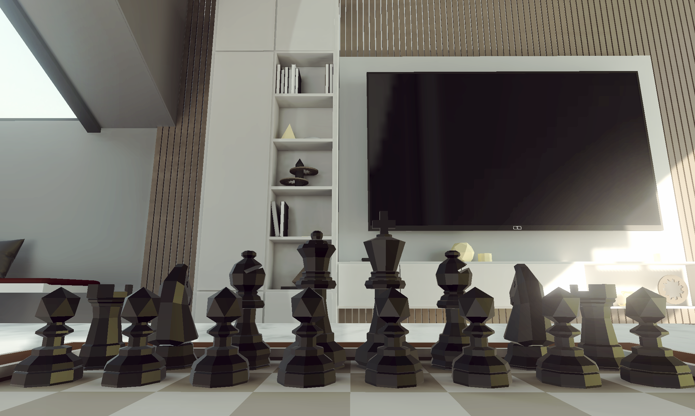
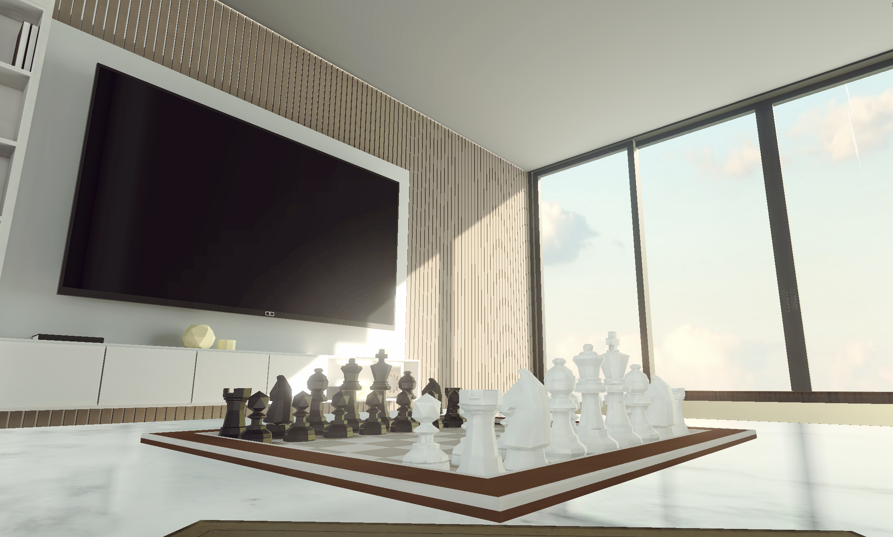
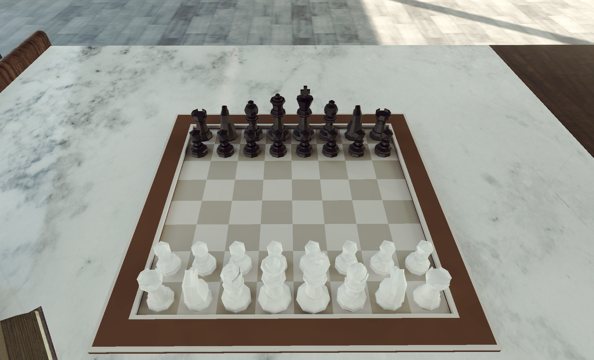

# ♟️ Chess Game

[](https://unity.com/)
[](LICENSE.txt)
[]()
[](https://github.com/edybostina/chess-game/issues)
[](https://github.com/edybostina/chess-game/stargazers)

A classic chess game built with Unity, featuring a clean UI, interactive gameplay, and a modular architecture. This project is ideal for anyone interested in game development, board game logic, or exploring Unity's capabilities.

## Features

- **Full Chess Rules**: Supports all standard chess rules, including castling, en passant, and pawn promotion.
- **Interactive UI**: Click-based piece selection and movement with real-time visual feedback.
- **Modular Design**: Organized codebase with separate components for game logic, UI, and board management.
- **Customizable Assets**: Easily replaceable piece sprites and board textures for personalization.

## Technologies Used

- **Unity**: Game engine for rendering and physics.
- **C#**: Primary programming language for game logic.
- **ShaderLab & HLSL**: For custom visual effects.

## 📂 Project Structure

- `Assets/`: Contains all game assets, including scripts, prefabs, and scenes.
- `ProjectSettings/`: Unity project settings and configurations.
- `.gitignore`: Specifies files and directories to be ignored by Git.
- `LICENSE.txt`: Project license information.

## 🚀 Getting Started

1. **Clone the Repository**:
   ```bash
   git clone https://github.com/edybostina/chess-game.git
   ```
2. **Open in Unity:**
  - Launch Unity Hub.
  - Click on "Add" and select the cloned repository folder.

3. **Play the Game**:
  - Open the main scene.
  - Click the "Play" button in the Unity Editor to start the game.

## 📸 Screenshots




## Contributing
Contributions are welcome! Feel free to fork the repository and submit pull requests. For major changes, please open an issue first to discuss what you'd like to change.

## License
This project is licensed under the MIT License. See the LICENSE.txt file for details.
   
